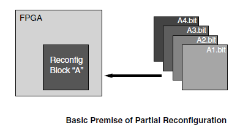

# Xilinx Dynamic Function eXchange (DFX) 

## Introduction

DFX allows users to flash partial bitstreams into reconfigurable zones on the FPGA. 

 

## Why would you want it? 

 1. Allows you to dynamically change your functionality

 2. Use FSMs to determine what hardware is placed and running 

 3. Information hiding: you can actually discard static information without memory 

## Why would you need it? 

 Biggest Reason: You ran out of area

## [How to do DFX in Xilinx with RTL](dfx_w_RTL.md)