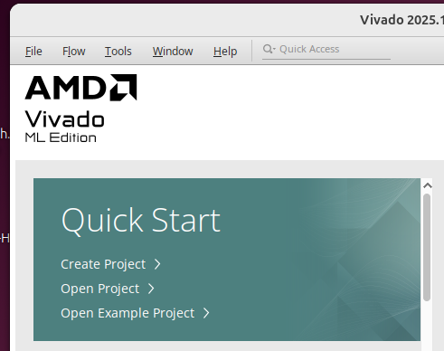
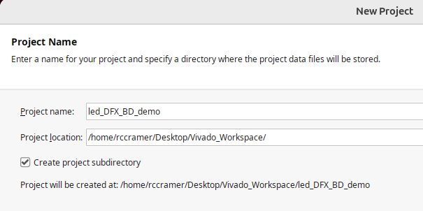
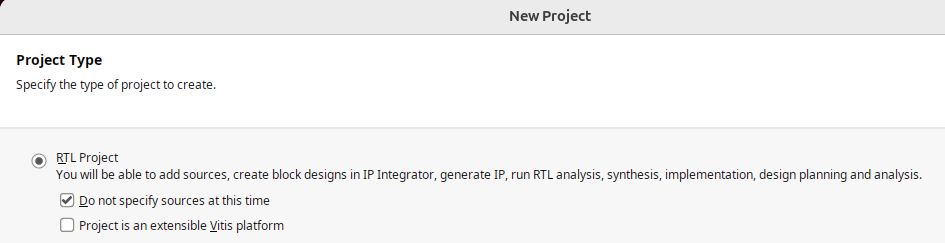
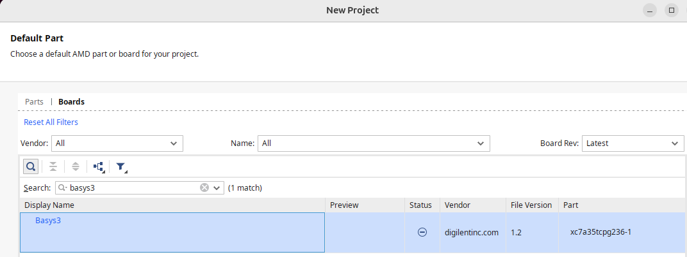
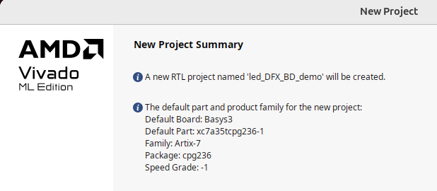
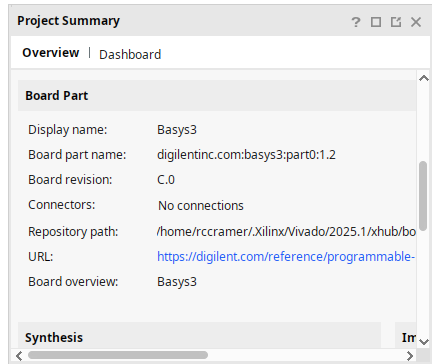

# How to do DFX with a Block Design Project in Vivado 

## Steps
 1. [Create a Project]() 
 2. [Enable Dynamic Function Exchange]()
 3. [Create a Hierarchy with your HDL sources]() 
 4. [Create a Partition]()
 5. [Add DFX Configurations]() 
 6. [Add DFX Run Configuration]()

 7. [Generate Constraints]() 
 
 8. [Synthesize then Draw DFX Pblock Region]()

 8. [Generate Bitstreams and Test on FPGA]()  

## Sources 
 1. [LED Shift](#led-shift) 
 2. [LED Count](#led-count)
 3. [LED Passthrough](#led-passthrough) 
 4. [Top Level SSEG Controller + DFX](#top-level-sseg-controller--dfx) 
 5. [Hex2Sseg](#hex2sseg) 

## Create a Project 

### Select "Create Project" after opening Vivado





 

### To avoid SNAPPING_MODE error, add the following to your XDC:

```tcl
set_property SNAPPING_MODE ON [get_pblocks pblock_rcfg_mod]
```