# How to do DFX with a Block Design Project in Vivado 

## Steps
 1. [Create a Project](#create-a-project)

 2. [Enable Dynamic Function Exchange](#enable-dfx)

 3. [Add Sources](#add-sources)

 4. [Create a Block Design](#create-a-block-design) 

 5. [Create a Block Design Heirarchy](#create-a-block-design-heirarchy) 

 6. [Add DFX Configurations](#add-dfx-configurations) 
 7. [Add DFX Run Configurations](#add-dfx-run-configurations)

 8. [Create HDL Wrapper and Generate Output Products](#create-hdl-wrapper-and-generate-output-products) 
 
 9. [Synthesize then Draw DFX Pblock Region](#synthesize)

 10. [Generate Bitstream](#generate-bitstream) 

 11. [Flash the board](#flash-the-board) 

## Sources 
 1. [LED Shift](src/led_shift.v) 
 2. [LED Count](src/led_count.v)
 3. [LED Passthrough](src/led_passthrough.v) 
 4. [Top Level SSEG Controller + DFX](src/sseg_hex_cntr.v) 
 5. [Hex2Sseg](src/hex2sseg.v) 

## Create a Project 

### Select "Create Project" after opening Vivado


### Name your project 


### Select RTL Project


### Select Basys 3 from the *Boards* tab (don't select a parts)


### The final project settings should look like this: 


### Once your project is created view the "Project Summary" window to ensure you have the Basys 3 part selected.
 

## Enable DFX 

### Go to Tools->Enable Dynamic Function eXchange 

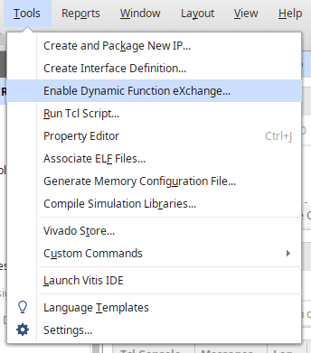 

### Convert your project to a DFX project 

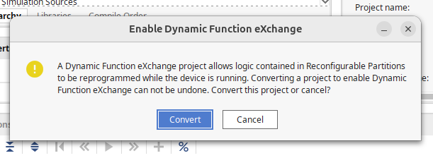 

## Add Sources 

### Add all the [rtl sources](#sources) 

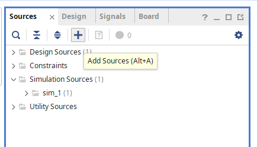 

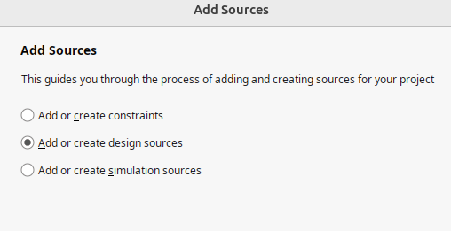

## Create a Block Design 

### Click "Create Block Design" under Flow Navigator 
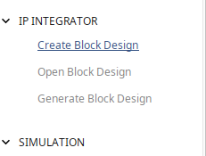 

### Name your Block Design 
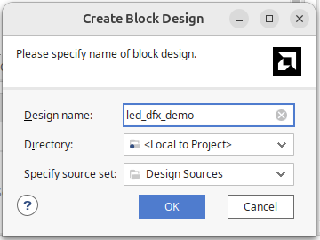

### Vivado should now pull up the block desing window. You should see something like this:
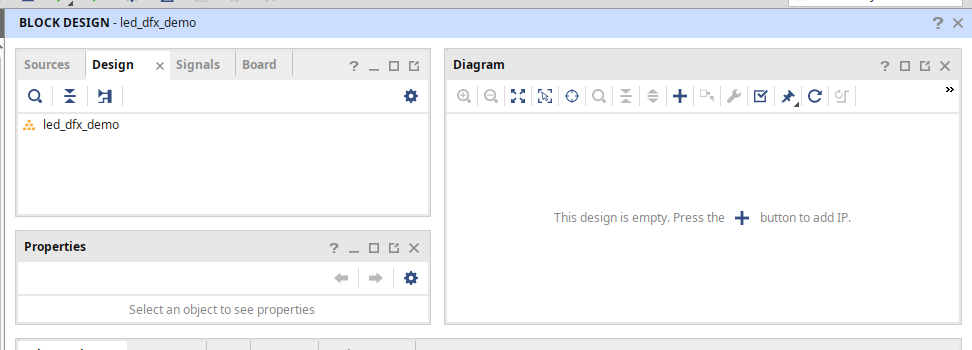

### Click Add IP 
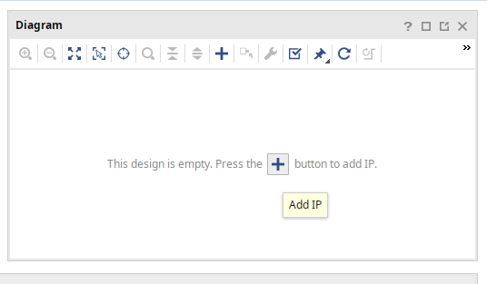 

### Add a Clock Wizard IP
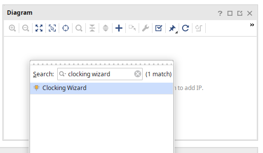

### Click "run connection automation" in the green banner. This will create external ports (that you won't add to your constraints file)
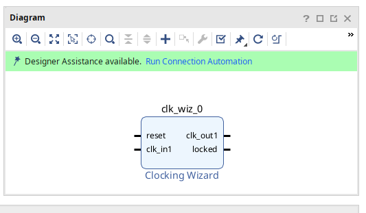

### In the connection automation window, click on the clk_in1 port to see what the Board Interface is. It should be sys_clock (System Clock). That is the 100Mhz clock
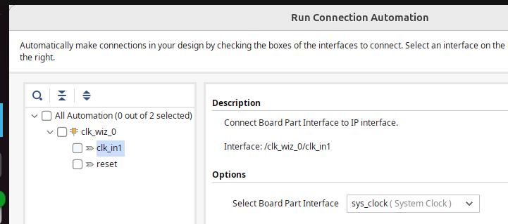

### In the connection automation window, click on the reset port to see what the Board Interface is. It should be reset (BTNC). That is the center button of the 5 Basys 3 buttons. 

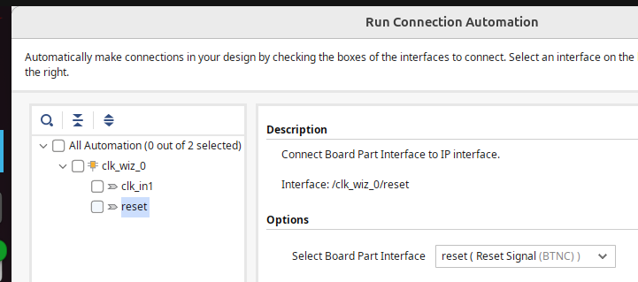

### Select all automation and continue 
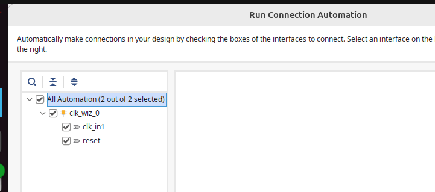

### Now you will have external sys_clock and reset ports (which Vivado internally manages as constraints)
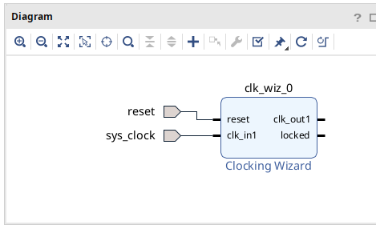

### Now add a Processor System Reset IP (this synchronizes the button reset to our clock)
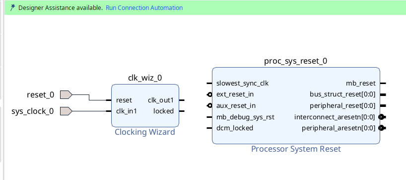

### If you look, the external reset is active low
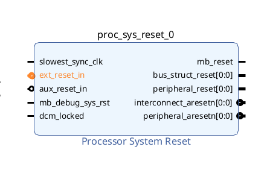

### You cannot change it
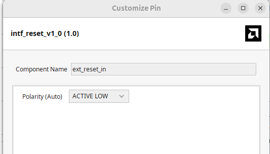

### Run connection automation and select  all automation 
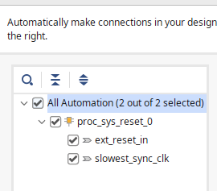

### Now validate your design and the external reset port becomes active high
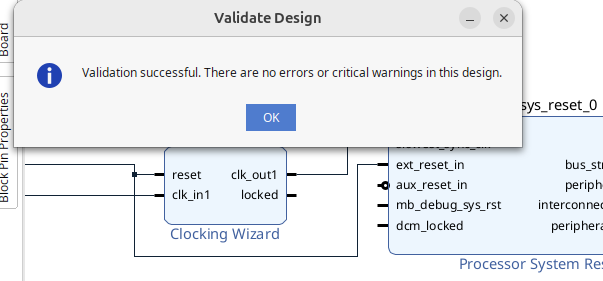

### (note the demo will appear out of sync based on the pictures but don't worry, just follow along)

### Right click and Create an External Port for your buttons 

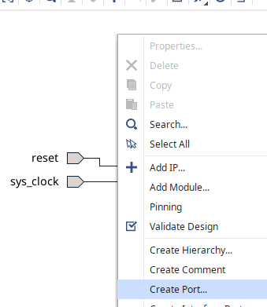

### Define the "btn" port as a 4 bit input 


### Now add the next port once btn[3:0] is created

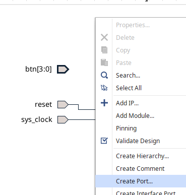

### Define the "sw" port as a 16 bit input 


### Now add the next port once sw[15:0] is created

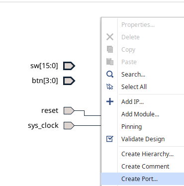

### Define the "led" port as a 16 bit output 


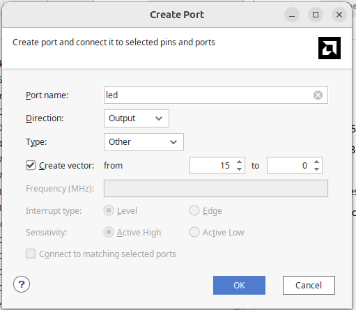

### Now do the same for the seven segment outputs

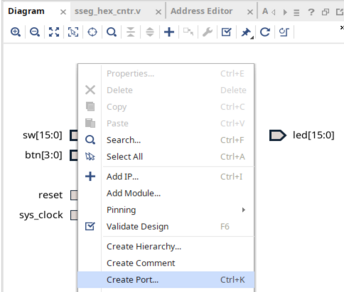

### For the 7 bit SSEG display output
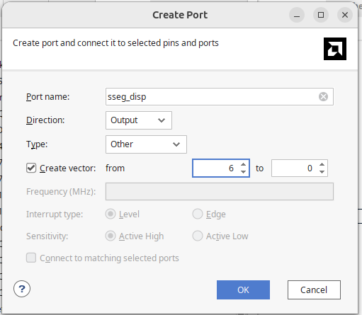

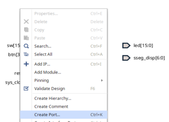

### and the 4 bit SSEG anode output 
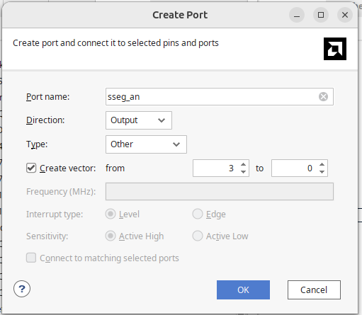

### Now it should look like this (with your processor system reset too )

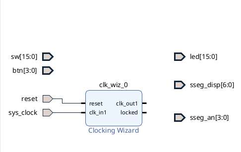

### Ignoring the out-of-sync diagram, right-click and "Add Module" 

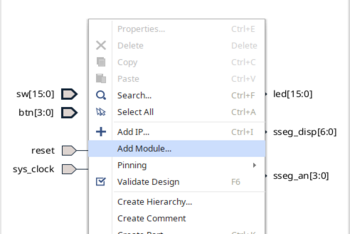

### Now add the sseg_hex_cntr.v module to the block design (only .v/.vhd can be added)
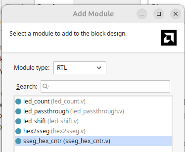

### The RTL source will have a circle that says RTL letting you know that it was HDL that was written. 

### Click on the ports and drag to other modules ports to connects 

### Connect the peripheral reset (not aresetn) to the rst port of the sseg_hex_cntr 
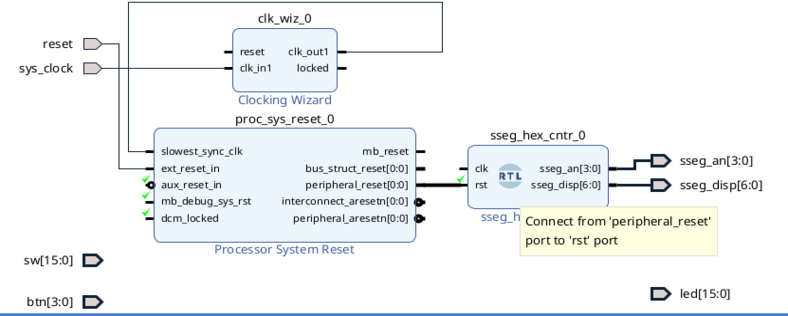

### Connect the clock wizard clock to the sseg_hex_cntr clk port 

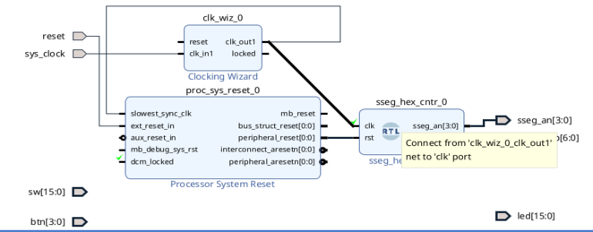

## Create a Block Design Heirarchy 
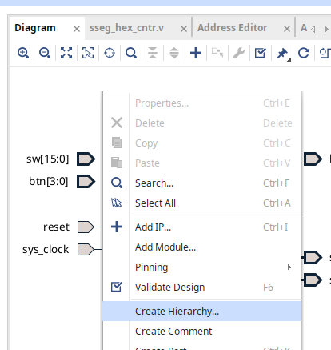

### Name your block design heirarchy
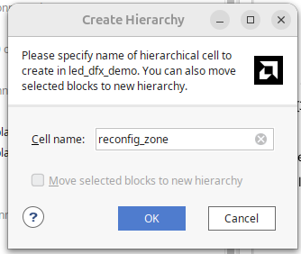

### You block design heirarchy will appear as a dark blue box 
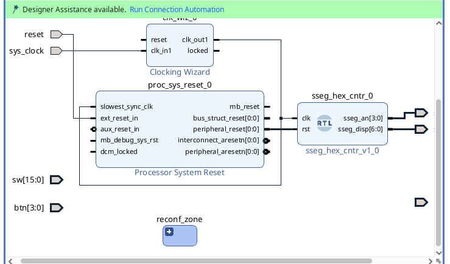

### Add one of the LED modules (reconfigurable modules) and drag it into the hierarchy 
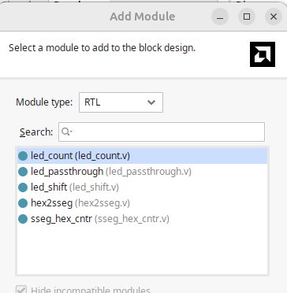

### Drag the module into the hierarchy
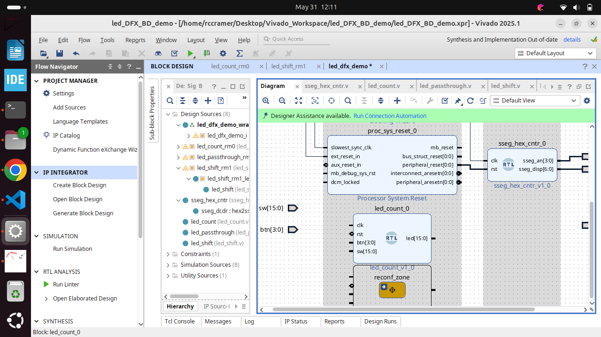

### Now it should look like this: 
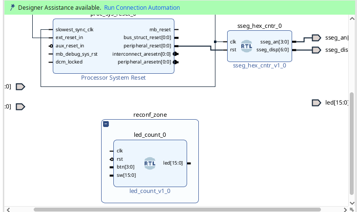

### The reset is active low by default, so you will have to change that
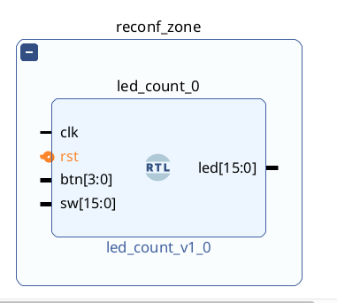
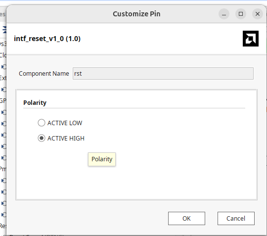 

### Now connect your module, right click it, and select "Create a Block Design Container" 
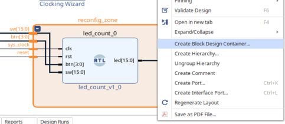

### Name your block design container the same as what you want your first reconfigurable module to be 

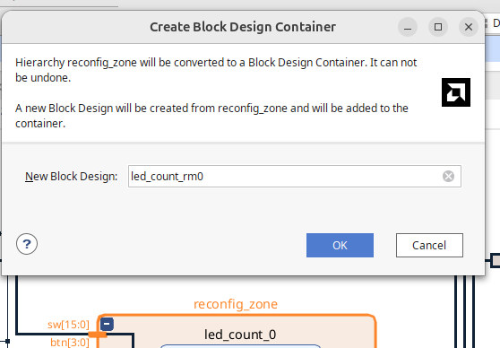 

### You will now see the heirarchy symbol appear, confirming your design is a Block Design Container 

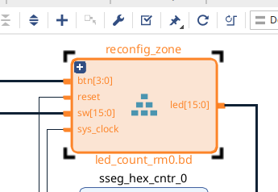

### Double click on the block design container: configure it as a DFX block and freeze the interface. 
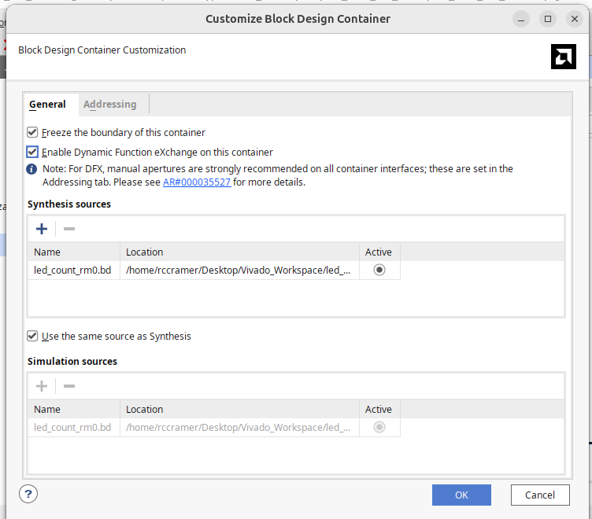

### After, your heirarchy should have the DFX logo, confirming it is now recognized as a DFX block 
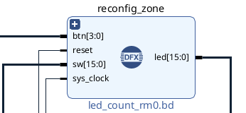

## Add DFX Configurations

### Right click on your DFX Heirarchy to "create reconfigurable module". This will allow you to add configuration 
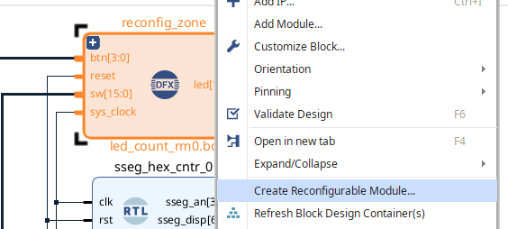

### Vivado will complain and say block design is not in a validated state, so validate and try again
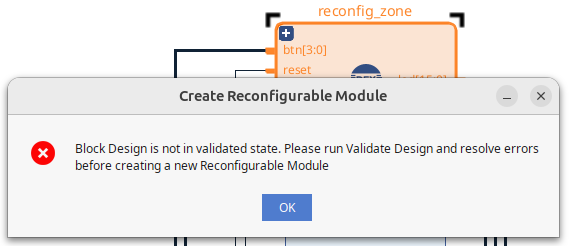

### Now name the next reconfigurable module and proceed
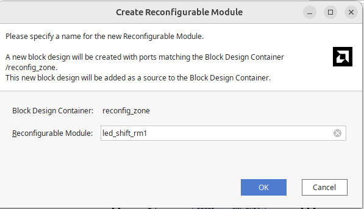

### This will create a new empty block design with the external ports already defined
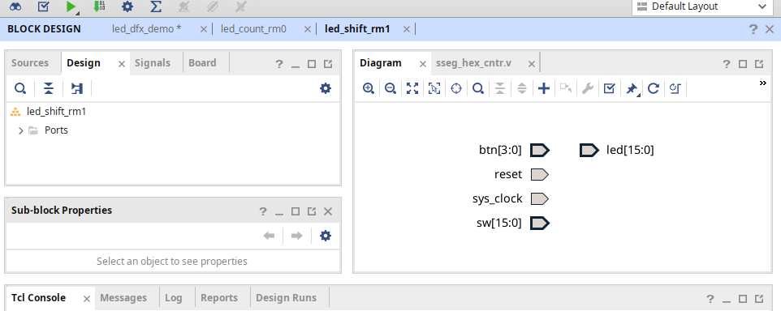

### Add one of the LED modules to the new block design 
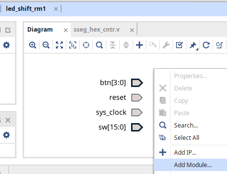

### Select one of the LED modules in the window 


### Now connect it


### Finally, validate the inner block design

### Then go validate the main block design. 

### Then add as many configurations as you want


### Don't forget to validate your block designs before adding a new configuration 


### If you didn't add the processor system reset, you will get this error: 


### If everything went smoothly, you should see this: 


## Add DFX Run Configurations 

### Start by going to Window->Configurations 


### Then launch the "Dynamic Function eXchange Wizard" by clicking the blue text in the "Configurations" window 


### You will be greeted by the DFX Wizard 


### Select "automatically create configurations" 


### Then you will have to select "automatically create configuration runs"  


### It will autopopulate "child" runs. AKA runs that inherit most of the implementation from another run. 

### Select "automatically create configurations" 


### If everything went smoothly, you will see three configurations added 


## Create HDL Wrapper and Generate Output Products 

### You have to generate output products for your design and create a top level wrapper before you can synthesize 

### Create an HDL Wrapper by right-clicking on your block design and selecting "Create HDL Wrapper" 


### Let Vivado manage the wrapper (trust me)


### Now right click and select generate output products for your block design 


### I recommend using 4 threads if you're on a laptop (it is less likely to crash)


### It will notify you that "Out-of-context module runs were launched" and you will see "Running multiple block runs" in the top right corner 


### Once you are done, you can proceed to generate your constraints and launch synthesis

## Synthesize 

### Now that you've added DFX configurations and finished your block design, it's time to synthesize 

### Add the constraints 


### You should see the constraints in your design sources now 


### Click "Run Synthesis" 


### Proceed with default settings (16 threads recommended) 


### You should see the modules completing in the Design Runs Window 


### Once synthesis has finished, "Open Synthesized Design" 


### In the Device View, find your "Netlist" tab and find your block design 
 

### Now find your Block Design Heirarchy in the netlist heirarchy 
 

### Right click the reconfigurable hierarchy and select Floorplanning->Draw & Create Pblock 
 

### Draw a pblock region appropriate for the design (the area I drew in the picture is probably too generous)

### (think in terms of 1 slice per 4 flip-flops in your design) 

 

### You will now have a pblock where your DFX modules will be placed 

 

### Press Ctrl+S to save, which will bring up this window. It will warn you that your Synthesis is out of date. Click ok. 
 

### It will then ask where you want to save the new Pblock constraints. Put them in your constraints you made. 
 

### You will now see a checkbox on the reconfigurable module, designating it's been marked as "placed" (even though we haven't ran Implementation with Place & Route) since you manually placed it. 
 

### Your constraints will need to be reloaded to see the changes (the changes will appear at the bottom)
 

### The changes will define a new pblock region as seen below: 
 

### To avoid SNAPPING_MODE error, add the following to your XDC:

```tcl
set_property SNAPPING_MODE ON [get_pblocks pblock_rcfg_mod]
```

 

## Generate Bitstream 

### Once you have your pblock configured, run generate bitstream. 
 

### You can launch runs with 16 threads

 

### You can watch the runs (and child runs) occur from the "Design Runs" tab

 

### You should slowly see the bistreams complete 
 

### If you get errors generating the bitstream, make sure all the input ports are constrained on your modules

 

### If you don't make it through implementation, you either forgot to add SNAPPING_MODE to your constraints, or it's because the pblock is too small

## Flash the board 

### Plug in the Basys 3

 

### Open hardware manager, connect to target, and program board (a full bitstream will be selected by default)
 

### You can either choose a full bitstream or a partial bitstream. The full bistreams will have the same name as your top level block design. The partials will have the reconfigurable module block design name and "partial" in its name 

### Each DFX configuration run's implementation folder will have the full and partial bitstreams

 

### Now try flashing the partials 
 

 

### *Note: All the partials will be in the main implementation or child implementation under PROJECT/PROJECT.runs/impl_X*

### Watch the counter tick up while you reflash the partials. The counter won't reset

 